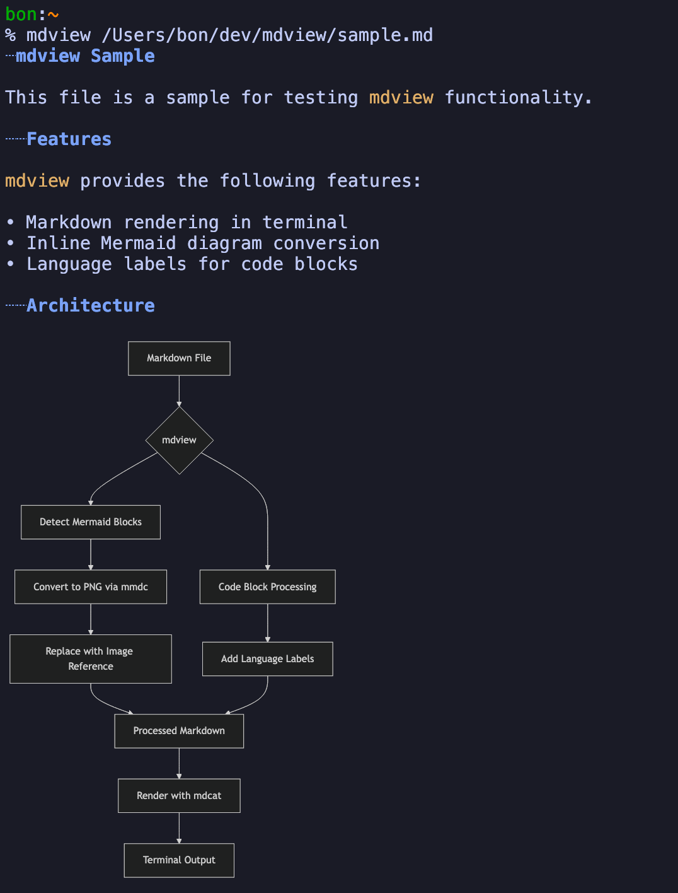
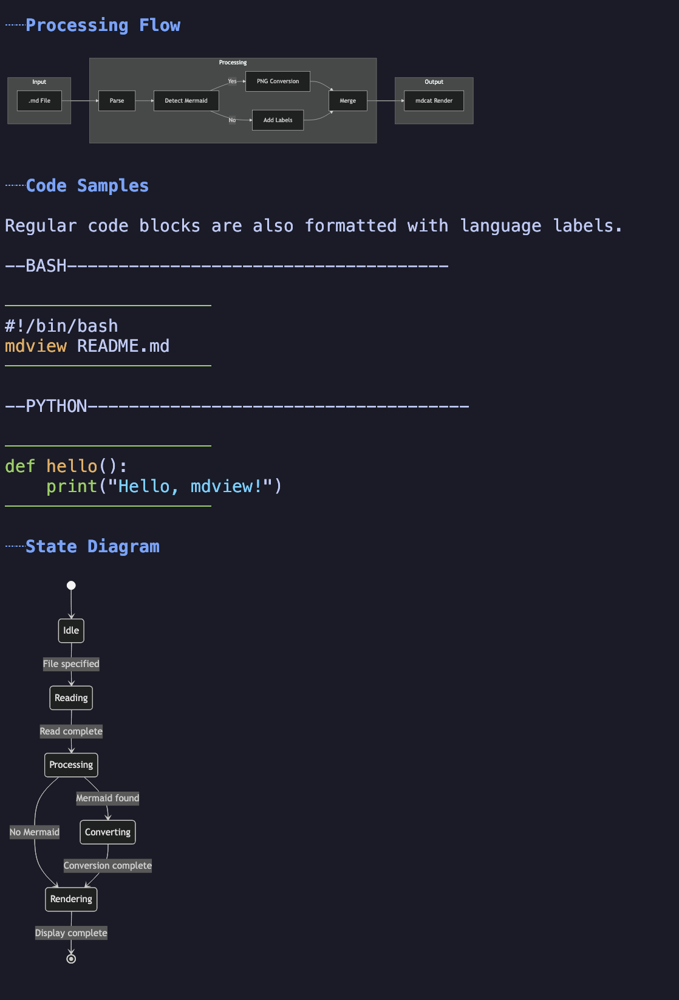

# mdview

Markdown + Mermaid viewer for the terminal. Displays Markdown files with inline Mermaid diagrams converted to images.

## Screenshots




## Features

- Renders Markdown in the terminal using `mdcat`
- Converts Mermaid diagrams to inline images via `mermaid-cli`
- Adds language labels to code blocks for readability

## Dependencies

- [mdcat](https://github.com/swsnr/mdcat) - Markdown rendering in terminal
- [mermaid-cli](https://github.com/mermaid-js/mermaid-cli) - Mermaid diagram rendering

## Installation

### Prerequisites

```bash
brew install mdcat
npm install -g @mermaid-js/mermaid-cli
```

### Quick Install (curl)

```bash
curl -fsSL https://raw.githubusercontent.com/bon-clevique/mdview/main/mdview -o /usr/local/bin/mdview && chmod +x /usr/local/bin/mdview
```

### Install from Source

```bash
git clone https://github.com/bon-clevique/mdview.git
cd mdview
chmod +x mdview

# Choose one:
# Option A: Symlink (updates when you git pull)
ln -s "$(pwd)/mdview" /usr/local/bin/mdview

# Option B: Copy
cp mdview /usr/local/bin/
```

> **Note:** `/usr/local/bin` にパーミッションエラーが出る場合は `sudo` を付けるか、`~/.local/bin` など自分のPATH配下にコピーしてください。

## Usage

```bash
mdview <markdown-file>
```

### Example

```bash
mdview README.md
mdview docs/architecture.md
```

## How it works

1. Parses the Markdown file for Mermaid code blocks
2. Converts each Mermaid diagram to a PNG image (dark theme, transparent background)
3. Replaces the code block with an image reference
4. Adds language labels above non-Mermaid code blocks
5. Renders the processed Markdown using `mdcat` with inline image support

## License

[MIT](LICENSE)
