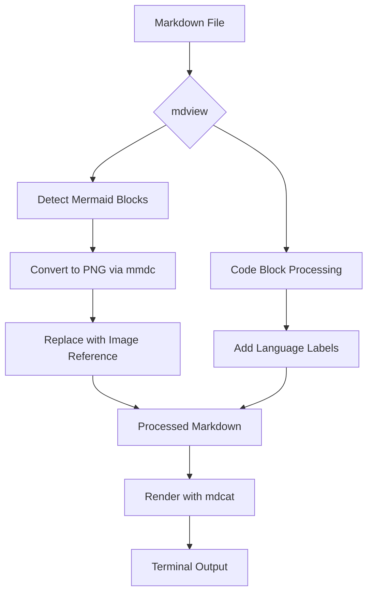
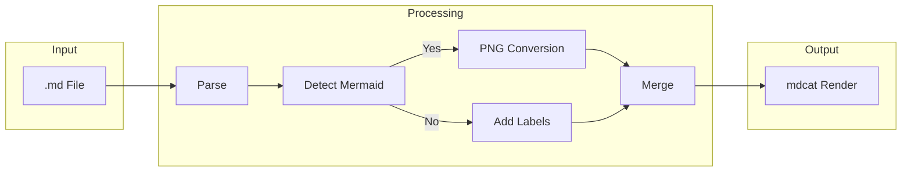
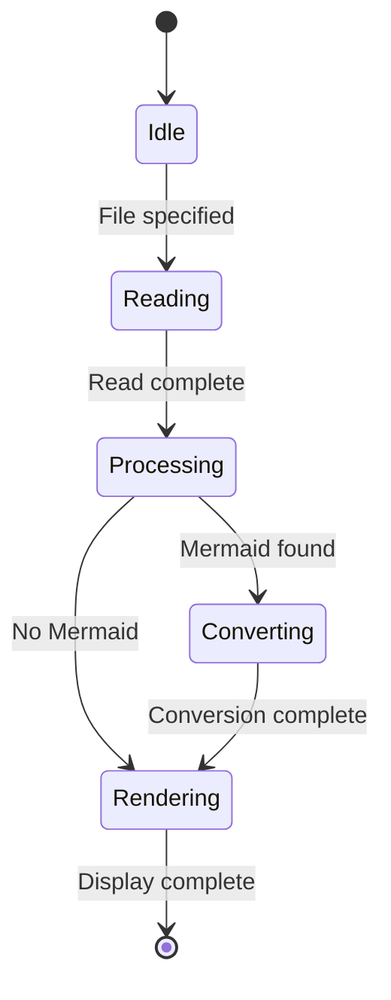

# mdview Sample

This file is a sample for testing `mdview` functionality.

## Features

`mdview` provides the following features:

- Markdown rendering in terminal
- Inline Mermaid diagram conversion
- Language labels for code blocks

## Architecture



## Processing Flow



## Code Samples

Regular code blocks are also formatted with language labels.

```bash
#!/bin/bash
mdview README.md
```

```python
def hello():
    print("Hello, mdview!")
```

## State Diagram



## Summary

Run `mdview sample.md` to see this file rendered in your terminal.
